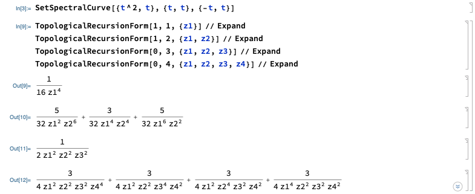

# Topological Recursion 
This is a preliminary not optimized package to compute Eynard Orantin topological recursion invariant forms of a given spectral curve of genus 0. In this case the fundamental bidifferential is unique. It allows for ramifications points of arbitrary order. This package runs in parallel with Combinatorica, so they both must be loaded together. 

```
<<"Combinatorica`"
<<"TopologicalRecursion`"
```

The two main functions to be used are SetSpectralCurve and TopologicalRecursionForm. 

### Defining a Spectral Curve

A Spectral Curve contains the data of two maps x(z) and y(z), together with a global deck transformation that exchanges the leaves around of the covering map x(z) near its ramification points. The variable z is a global coordinate on CP^1.  

```
SetSpectralCurve[{x(z),z},{y(z),z},{T(z),z}]
```

### Compute Topological Recursion Invariants

The characteristic invariant forms W_{gn} with boundary components labeled by {p1,...,pn} can be computed with TopologicalRecursionForm[g,n,{p1,...,pn}].   

```
TopologicalRecursionForm[1,1,{p1}]
TopologicalRecursionForm[0,3,{p1,p2,p3}]
TopologicalRecursionForm[1,2,{p1,p2}]
```
#### Remark
The number n must match the number of input variables.

### Examples

The most simple and important example is the Airy Spectral curve. 


